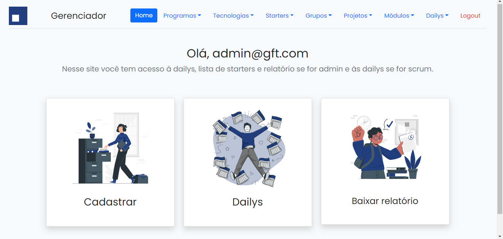
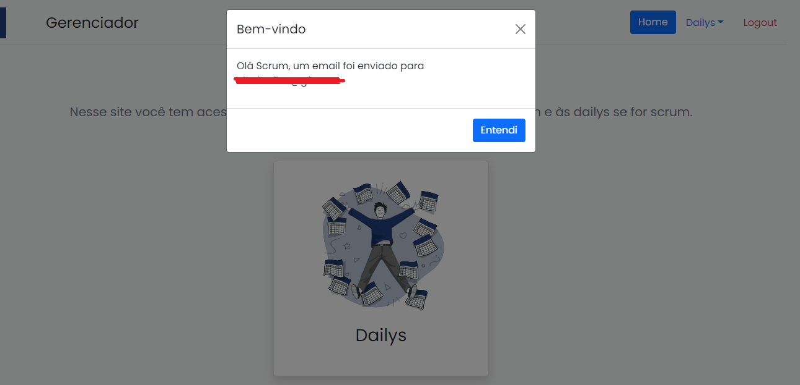
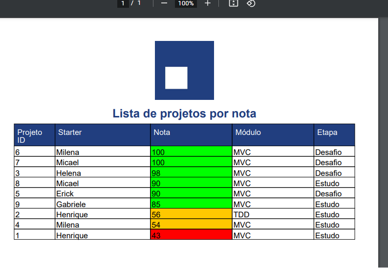
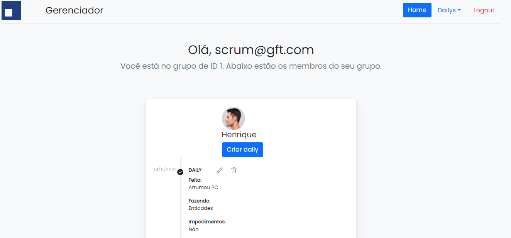
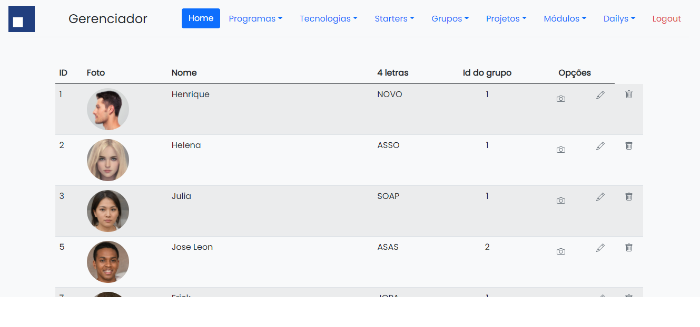

# Projeto Java - MVC

## Proposta
Criar controle de estagiários GFT.

### Regras Gerais
- 👉 Popular banco: ou com botão ou assim que iniciar a aplicação.
- 👉 Criar CRUD para todas as entidades acima
- 👉 Validação de todos os campos
- 👉 Login Gerente com acesso a toda a Aplicação
- 👉 Login SM(Scrum Master) com acesso apenas as Dailys
- 👉 Pode acrescentar entidades se achar necessário, juntar, mas não pode eliminar
### Exceeds
- ✔ Cadastro de Empregado com foto.
- ✔ Gerar um relatório em PDF mostrando quais Starters tem maior nota e menor nota.
- ✔ Enviar email automático para EMAIL_OCULTADO@EMAIL.com sempre que um scrum acessar a aplicação. 
(Se quiser testar, substitua em application.properties o email que enviará, ou no EmailController o que receberá) 


## Como rodar

Use o ```mvnw``` para Linux e ```mvnw.cmd``` para Windows
```
./mvnw spring-boot:run
```
 

###  DADOS DE LOGIN:
+ Para o admin:
  + Email: **admin@gft.com**
  + Senha: **123456**
+ Para o scrum:
  + Email: **scrum@gft.com**
  + Senha: **123456**

## Fotos
<p align="center">
    
    
    
    
    
    
</p>


###  POPULAÇÃO DO BANCO
+ Ocorre com data.sql, então o banco é populado ao iniciar a aplicação.
+ No HeidiSQL, bem como no application.properties, 
o login está como root, a senha vazia e a porta como 3306.

###  BANCO E IDE
+ MySQL
+ Intellij
+ Java 11
+ Illustrations by storyset.com ❤


